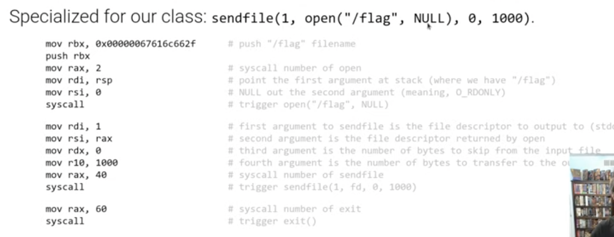
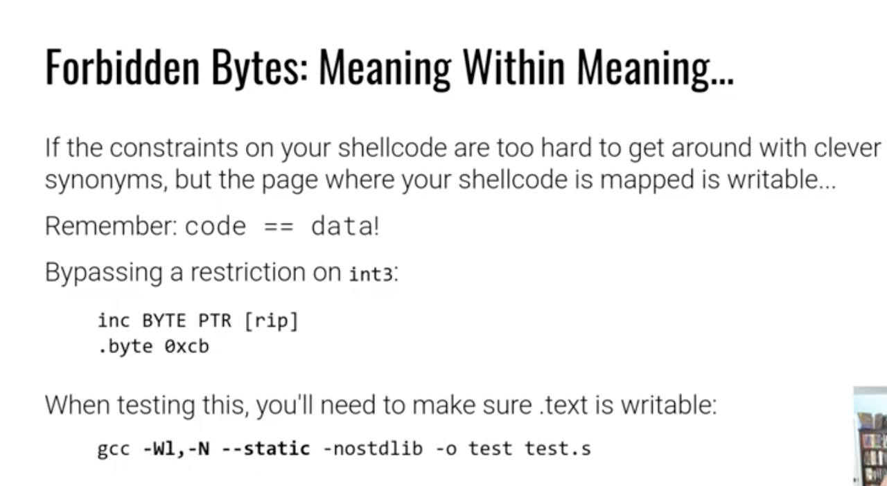

# Just my exploration into Binary Exploitation

- Note: much of these notes are taken from pwn.college youtube videos

Many things to learn and do, but I'll list a basic todo for myself for now

- [ ] Finish pwn.college youtube videos
- [ ] Try out the LinkedList imaginaryCTF 3 levels challenge
- [ ] Get started on ROP Emporium
- [ ] Get started on ProtoStar
- [ ] Try a integer overflow/underflow challenge
- [ ] Try a House of \* Challenge
- [ ] Figure out what is seccomp
- [ ] Figure out what is qemu and mips

### Kali Setup / Useful Tools

- Install [pwninit](https://github.com/io12/pwninit)
  - Setup
    - install cargo: `curl https://sh.rustup.rs -sSf | sh`
    - install pwninit: `cargo install pwninit`
    - I faced an error
    ```
    warning: failed unstripping libc: failed running eu-unstrip, please install elfutils: No such file or directory (os error 2)
    ```
  - Usefulness:
    - Helps you download a linker that will help you load a provided `libc` without segfaulting
    - Downloads debug symbols and unstrips the `libc`
    - Follow this up with `patchelf` to use the correct RPATH and interpreter for the provided `libc`
- Install [patchelf](https://github.com/NixOS/patchelf)

  - `sudo apt -y install patchelf`
  - configures the binary to use the `ld` linker file that was downloaded from `pwninit` rather than the system's one
  - e.g. `patchelf --set-interpreter <ld file from pwninit> <binary file to use ld file>`
  - Once this is done, can run `LD_PRELOAD=<libc.so file> ./binary`

- Can run `readelf -a <binary>` to see the headers + segments, or just find out ELF info
- `ldd <binary>` shows you which libc and which linker the binary is configured to use. Can use this to check if the binary is using the system libc or the one in your directory.
- `checksec --file=<binary>` to see protections

  - `RELRO`: determines if Global Offset Table is writable
  - `NX`: determines if stack is executable --> can put shellcode on stack
  - `PIE`: depends if ASLR (Address Space Layout Randomization is enabled) --> different addresses each time
    - Note that in GDB its configured to disable ASLR all the time, see below for command to turn enable it
    - ASLR must maintain the last 3 nibbles (1.5 bytes) the same based on alignment and relative offsets

- Don't forget to create a `flag.txt` file sometimes, otherwise the binary might give a segfault if it `freads` or `fopen` from that file

- Install VSCode

  - sudo apt update
  - sudo apt install curl gpg gnupg2 software-properties-common apt-transport-https
  - curl https://packages.microsoft.com/keys/microsoft.asc | gpg --dearmor > microsoft.gpg
  - sudo install -o root -g root -m 644 microsoft.gpg /etc/apt/trusted.gpg.d/
  - echo "deb [arch=amd64] https://packages.microsoft.com/repos/vscode stable main" | sudo tee /etc/apt/sources.list.d/vscode.list
  - sudo apt update
  - sudo apt install code

- Edit `PATH` to be able to use the binaries you install

  - check with shell you are using with `ps -p $$`
    - Bash --> edit `~/.bashrc`
    - Zsh --> edit `~/.zshrc`
  - `export PATH="$PATH:/home/kali/.local/bin:/home/kali/.cargo/bin"`

- can use `strace` to view system calls
- `nm -D <binary>` to see what function imports there are

  - shows symbols in binaries

- rappel [https://github.com/yrp604/rappel](https://github.com/yrp604/rappel) lets you explore the effects of instructions.

  - easily installable via [https://github.com/zardus/ctf-tools](https://github.com/zardus/ctf-tools)

- amd64 opcode listing: [http://ref.x86asm.net/coder64.html](http://ref.x86asm.net/coder64.html)

### Useful Links

- Libc Database: [https://libc.blukat.me/](https://libc.blukat.me/)
- CryptoCat Pwn Github: [https://github.com/Crypto-Cat/CTF/tree/main/pwn](https://github.com/Crypto-Cat/CTF/tree/main/pwn)
- ROP Emporium: [https://ropemporium.com/](https://ropemporium.com/)
- Exploit Education: [https://exploit.education/](https://exploit.education/)
- Pwn College: [https://pwn.college/](https://pwn.college/)
- ROP Gadget: [https://github.com/JonathanSalwan/ROPgadget](https://github.com/JonathanSalwan/ROPgadget)
- Syscall Table: [https://blog.rchapman.org/posts/Linux_System_Call_Table_for_x86_64/](https://blog.rchapman.org/posts/Linux_System_Call_Table_for_x86_64/)

### GDB stuff

- `x/32gx <0xaddress>`
  - `x` == examine
  - `gx` == 8 bytes values in hexadecimal
- `disass main`
  - disassemble the main function
- `info functions`
  - show list of all defined functions
- `info registers`
  - see values held in registers
- `set disable-randomization off`
  - enable ASLR
- `b *(0xaddress)`
  - set breakpoint at the particular address
- `heap`: examine heap (including tcache)
- `p $rdx`: prints value of rdx register
  - `p/x` to print in hexadecimal format
- `bins` to see bins lol

```python
pwndbg> bins
tcachebins
0x90 [  2]: 0x603890 —▸ 0x603800 ◂— 0x0
fastbins
0x20: 0x0
0x30: 0x0
0x40: 0x0
0x50: 0x0
0x60: 0x0
0x70: 0x0
0x80: 0x0
unsortedbin
all: 0x0
smallbins
empty
largebins
empty
```

- `fini` to step out of a function call, especially if you're going through a glibc function currently
- press enter to repeat previous command
- `vis_heap_chunks`: visualize heap chunks
- `info proc map`: shows where process is loaded in memory
- print the next 5 instructions: `x/5i $rip`
- examine:
  - qwords: `(x/gx $rsp)`
  - dwords: `(x/2dx $rsp)`
  - halfwords: `(x/4hx $rsp)`
  - bytes: `(x/8b $rsp)`

### Ghidra stuff

- `l` to rename variable
- If you see stuff like `&DAT_00400b53`, means it is a global variable
  - double click, if its a string, can just `cmd + l` to change variable data type to like `char [3]`

### Shellcode basics

- typical goal is to launch `execve("/bin/sh", NULL, NULL);`

```bash
.global _start
_start:
.intel_syntax noprefix
  mov rax, 59 # syscall number of execve
  lea rdi, [rip + binsh] #point first argument of execve to the /bin/sh string
  mov rsi, 0 # set second argument, argv NULL
  mov rdx, 0 # set third argument, envp, NULL
  syscall #trigger syscall

binsh: #label of where the string is
  .string "/bin/sh"
```

- by default its ATNT, but can specify intel
- assemble with `gcc -nostdlib -static shellcode.s -o shellcode-elf`
  - this gives ELF with shellcode as `.text`
- extract with

```
objcopy --dump-section .text-shellcode-raw shellcode-elf
```

- contains the raw bytes of the shellcode, and inject as part of exploit
- interesting way to pipe in and pipe out

```bash
(cat shellcode.raw; cat) | ./<vulnerable-bin>
```

- ways to include data in code

1. `.byte 0x48, 0x45, 0x4C, 0x4F # "HELLO"`
2. `.string "HELLO" # "HELLO\0"`
3.

```python
mov rbx, 0x0068732f6e69622f # movve "/bin/sh\0" into rbx
push rbx # push "/bin/sh\0" onto the stack
mov rdi, rsp #point rdi at the stack
```

- Open `/flag` and send to stdout
  

- If you need to replicate exotic conditions that are hard to do as a preamble to shellcode, can build a shellcode loader in c

```c
// create a function pointer, mmap a space that is executable and load the shellcode in and execute
page = mmap(0x1337000, 0x1000, PROT_READ|PROT_WRITE|PROT_EXEC, MAP_PRIVATE|MAP_ANON, 0,0)
read(0, page, 0x1000);
((void(*)())page)()
```

- debug shellcode at high level using `strace` --> trace system calls
- for more analysis in `gdb`
  - use `si` to step one instruction, following the call instructions, not `s`
  - use `ni` to step over call instructions, not `n`
- breakpoints can be hardcoded with the `int3` instruction

  - useful to do this right before the syscall, need to be handled either in code or in debugger

- Shellcode for other architectures
  - Compiling
    - amd64: `gcc -nostdlib -static shellcode.s -o shellcode-elf`
    - mips: `mips-linux-gnu-gcc -nostdlib shellcode-mips.s -o shellcode-mips-elf`
  - Running
    - amd64: `./shellcode`
    - mips: `qemu-mips-static ./shellcode-mips`
  - useful Qemu options:
    - `-strace` : print out log of system calls
    - `-g 1234`: wait for gdb connection on port 1234. Connect with `target remote localhost:1234` in `gdb-multiarch`
- Note: I have no idea how to work with qemu and mips, is a long todo

- Common issues
  
  
  

### Random

- returned values are stored in `$rax`
- `LANG` environment variable determines sorting of file from `ls`
- standard is `int main(int argc, char **argv, char **envp)`
- `objdump -d <binary> -M intel`
  - use `-d` for disassemble
  - use `-M` for intel syntax because ATNT assembly is weird on x86
- `du -sb <file>`: shows number of bytes in file
- `kill -l`: lists all the signals
- `pgrep <process>` === `ps aux | grep <process>`
  - used to find the process Id so you can do something like `kill -9 <process>` to kill it
- `/dev/shm` is used for shared memory mapped files
  - requires system calls to establish, but afterwards don't need, just pass the file descriptors around
- processes terminate only either by unhandled signals (e.g. SIG 10, segfault) or exit system call
  - after termination, processes remain in zombie state until `wait()` is called by their parents on them, then their exit code will be returned to parents and be freed
  - if parent dies before this happens, they are re-parented to PID 1 until cleaned up
    - PID 1 --> first process started by linux kernel /init process for shutting down + starting up system
